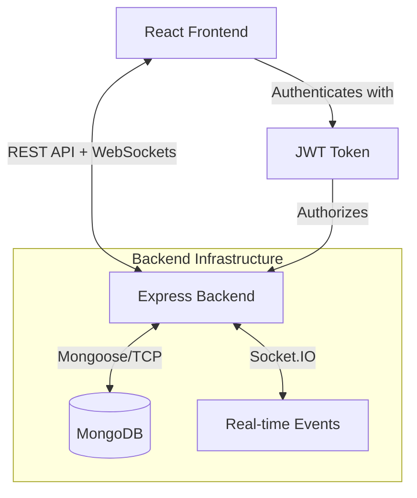

# ServiceHub


ServiceHub is a comprehensive full-stack web platform designed to seamlessly connect customers with local service providers. Customers can easily discover services, manage bookings, communicate in real-time, and leave reviews. Service providers have access to a dedicated dashboard to efficiently manage their offerings, track bookings, and interact with customers. Platform administrators maintain oversight with robust user, service, and activity management capabilities.

## Table of Contents
- [Features](#features)
- [Tech Stack](#tech-stack)
- [Architecture](#architecture)
- [Project Structure](#project-structure)
- [Screenshots](#screenshots)
- [Installation](#installation)
- [Environment Variables](#environment-variables)
- [Running Tests](#running-tests)
- [Docker](#docker)
- [API Reference](#api-reference)
- [Future Improvements](#future-improvements)
- [Contributing](#contributing)
- [License](#license)
- [Contact](#contact)

## Features

### Authentication & Authorization
- Secure JWT-based authentication
- Protected routes based on user roles
- Role-Based Access Control (Customer, Provider, Admin)

### Customer Features
- Dedicated customer dashboard
- Browse and search for services
- Advanced filtering and sorting options
- Book services with local providers
- View and manage booking history
- Leave reviews and ratings for services

### Provider Features
- Dedicated service provider dashboard
- Create and manage service listings
- Accept, decline, and manage incoming bookings
- Manage profile and contact information

### Admin Features
- Comprehensive admin dashboard
- Manage registered users and user roles
- Oversee and moderate platform services
- Monitor platform activity and bookings

### Real-Time Features
- Real-time chat functionality between customers and providers
- Instant push notifications for booking updates and messages
- Socket.io integration for seamless real-time data sync

### Reviews
- 5-star rating system
- Written reviews and feedback
- Display aggregated service ratings

## Tech Stack

| Domain | Technology | Description |
| :--- | :--- | :--- |
| **Frontend** | React, TypeScript, Vite | Core frontend framework and build tool |
| **Styling** | TailwindCSS | Utility-first CSS framework for rapid UI development |
| **State Management** | Redux Toolkit, RTK Query | Application state and data fetching |
| **Backend** | Node.js, Express.js | Server runtime and API framework |
| **Real-time** | Socket.IO | Bidirectional event-based communication |
| **Database** | MongoDB, Mongoose | NoSQL database and object modeling |
| **Security** | JSON Web Tokens (JWT) | Secure authentication |
| **Testing** | Jest, Supertest | Unit testing and API integration testing |

## Architecture



## Project Structure

```text
ServiceHub/
├── backend/
│   ├── controllers/      # Route controllers (logic)
│   ├── middlewares/      # Express middlewares (auth, roles)
│   ├── models/           # Mongoose database schemas
│   ├── routes/           # API route definitions
│   ├── socket/           # Socket.IO configuration and events
│   ├── tests/            # Jest and Supertest integration tests
│   ├── app.js            # Express application setup
│   └── server.js         # Entry point and server initialization
├── frontend/
│   ├── public/           # Static assets
│   ├── src/
│   │   ├── app/          # Redux store and RTK Query API slices
│   │   ├── components/   # Reusable React components
│   │   ├── hooks/        # Custom React hooks
│   │   ├── pages/        # Page components (views)
│   │   ├── routes/       # React Router configuration
│   │   └── main.tsx      # React application entry point
│   ├── index.html        # HTML template
│   └── package.json      # Frontend dependencies
├── docker-compose.yml    # Docker services configuration
└── README.md             # Project documentation
```

## Screenshots

### Home Page

> Add screenshot here

### Customer Dashboard

> Add screenshot here

### Provider Dashboard

> Add screenshot here

### Booking Page

> Add screenshot here

### Chat

> Add screenshot here

### Admin Dashboard

> Add screenshot here

<details>
<summary>Click to expand</summary>
Placeholders added as requested to prevent clutter. Feel free to replace these quotes with image references once you have the screenshots.
</details>

## Installation

### Prerequisites
- Node.js (v16 or higher)
- MongoDB running locally or a MongoDB Atlas URI

### Backend Setup

1. Navigate to the backend directory:
   ```bash
   cd backend
   ```
2. Install dependencies:
   ```bash
   npm install
   ```
3. Set up your environment variables (see [Environment Variables](#environment-variables)).
4. Start the development server:
   ```bash
   npm run dev
   ```

### Frontend Setup

1. Navigate to the frontend directory:
   ```bash
   cd frontend
   ```
2. Install dependencies:
   ```bash
   npm install
   ```
3. Start the development server:
   ```bash
   npm run dev
   ```

## Environment Variables

Create a `.env` file in the `backend` directory with the following variables:

| Variable | Description | Example |
| :--- | :--- | :--- |
| `PORT` | The port the backend server runs on | `5000` |
| `MONGO_URI` | Connection string for MongoDB | `mongodb://localhost:27017/servicehub` |
| `JWT_SECRET` | Secret key for signing JWT tokens | `your_super_secret_key` |
| `CLIENT_URL` | The URL of the frontend application | `http://localhost:5173` |

## Running Tests

The backend uses Jest and Supertest for robust API and integration testing.

To run the test suite, navigate to the `backend` directory and execute:

```bash
cd backend
npm run test
```

## Docker

Docker support is currently being integrated into the project.

Once available, you will be able to spin up the entire application (frontend, backend, and database) using Docker Compose:

```bash
docker-compose up --build
```

## API Reference

The backend provides a comprehensive RESTful API for client interaction:

- **Authentication endpoints:** User registration, login, and token verification.
- **Service endpoints:** Fetching, creating, updating, and deleting service listings. Includes advanced search and filtering.
- **Booking endpoints:** Managing the complete booking lifecycle from request to completion or cancellation.
- **Review endpoints:** Leaving and retrieving service reviews.
- **Notification endpoints:** Managing unread counts and read statuses for real-time notifications.
- **Chat endpoints:** Retrieving message history and active chat conversations.

*Detailed Swagger/OpenAPI documentation coming soon.*

## Future Improvements

- Online payments integration (e.g., Stripe)
- Email notifications for booking confirmations
- Push notifications for mobile web users
- Provider availability calendar sync
- Native mobile application (React Native)

## Contributing

Contributions, issues, and feature requests are welcome!

1. Fork the project.
2. Create your feature branch (`git checkout -b feature/AmazingFeature`).
3. Commit your changes (`git commit -m 'Add some AmazingFeature'`).
4. Push to the branch (`git push origin feature/AmazingFeature`).
5. Open a Pull Request.

## License

Distributed under the MIT License. See `LICENSE` for more information.

## Contact

Your Name - [@YourTwitter](https://twitter.com/your_twitter) - email@example.com

Project Link: [https://github.com/your-username/ServiceHub](https://github.com/your-username/ServiceHub)
